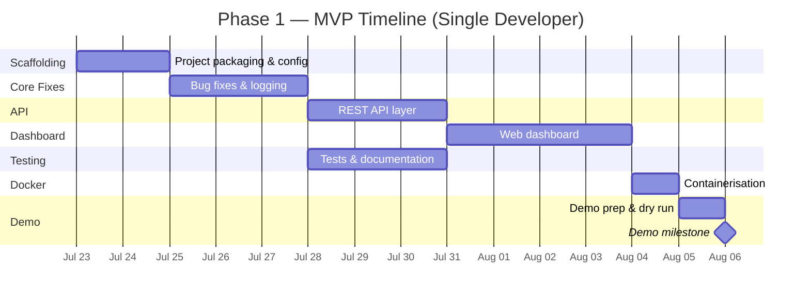

# Plausibility AI — Phase 1: MVP Implementation Plan

> **Status:** Planning
> **Target:** Demo-ready MVP
> **Audience:** Internal Engineering Team
> **Last Updated:** 2026-07-22

---

## 1. Phase 1 Goal

Deliver a **demo-ready MVP** that proves the end-to-end value of AI-assisted plausibility review. The MVP should be deployable on internal infrastructure, functional against real data, and presentable to stakeholders for buy-in to proceed to productionisation (Phase 2).

### MVP Success Criteria

- [ ] End-to-end pipeline works reliably on 2–3 real model PDFs and a sample Excel report.
- [ ] Lightweight web dashboard allows reviewers to browse and approve/reject AI findings.
- [ ] Basic test coverage (>60%) on core modules.
- [ ] Runnable via Docker Compose (single-command setup).
- [ ] Documentation sufficient for another engineer to run the demo.

---

## 2. Current State Assessment

### What Exists (Prototype)

| Module | Status | Notes |
|---|---|---|
| `extraction/breach_extractor.py` | ✅ Working | Hardcoded column mapping — acceptable for MVP |
| `indexing/pdf_parser.py` | ✅ Working | pymupdf4llm-based, chunking works |
| `indexing/code_parser.py` | ✅ Working | AST-based, function/class granularity |
| `indexing/vector_store.py` | ✅ Working | ChromaDB with custom embeddings |
| `indexing/metadata_generator.py` | ✅ Working | LLM-generated model metadata |
| `retrieval/rag_retriever.py` | ✅ Working | Two-source retrieval (docs + code) |
| `analysis/llm_client.py` | ✅ Working | Async with tenacity retry |
| `analysis/prompt_builder.py` | ✅ Working | Structured system + user prompts |
| `analysis/response_parser.py` | ✅ Working | Pydantic validation with fallback |
| `output/excel_annotator.py` | ✅ Working | Colour-coded, summary sheet |
| `cli.py` | ✅ Working | `index` and `analyze` commands |
| `config.py` | ✅ Working | YAML-based, dataclass config |
| `models.py` | ✅ Working | Core domain models |
| `backtesting/` | ❌ Empty | Out of scope for Phase 1 |
| `tests/` | ❌ Empty | Needs population |

### Key Gaps for MVP

1. **No project packaging** — No `pyproject.toml`, not installable.
2. **No tests** — Zero test coverage.
3. **No web UI** — CLI-only interaction.
4. **No containerisation** — No Docker support.
5. **No API layer** — No way to programmatically trigger analysis.
6. **No `.gitignore`** — Project scaffolding incomplete.
7. **No structured logging** — Basic `logging.basicConfig` only.
8. **No configuration validation** — Invalid configs fail silently or with cryptic errors.

---
  
## 3. Dependency Map

Understanding the dependency tree is critical for ordering implementation work.

### Python Dependencies (Poetry `pyproject.toml`)

```
pyproject.toml
├── openpyxl>=3.1.0          # Excel read/write
├── pymupdf4llm>=0.0.5       # PDF → Markdown
├── PyMuPDF>=1.24.0           # PDF engine (pymupdf4llm dependency)
├── chromadb>=0.4.0           # Vector database
├── httpx>=0.24.0             # Async HTTP for LLM API
├── tenacity>=8.2.0           # Retry logic
├── pydantic>=2.0.0           # Schema validation
├── PyYAML>=6.0               # Config parsing
├── click>=8.1.0              # CLI framework
└── rich>=13.0.0              # CLI formatting
```

### New Dependencies (Phase 1)

| Dependency | Purpose | Category |
|---|---|---|
| `fastapi>=0.104.0` | REST API framework for web dashboard backend | API |
| `uvicorn>=0.24.0` | ASGI server for FastAPI | API |
| `jinja2>=3.1.0` | HTML templating for lightweight dashboard | UI |
| `python-multipart>=0.0.6` | File upload support in FastAPI | API |
| `pytest>=7.4.0` | Test framework | Dev |
| `pytest-asyncio>=0.21.0` | Async test support | Dev |
| `pytest-cov>=4.1.0` | Coverage reporting | Dev |

### Infrastructure Dependencies

| Component | Requirement | Notes |
|---|---|---|
| **Python** | 3.14+ | Required for type syntax and runtime used in codebase |
| **vLLM server** | Running on `localhost:8000` (configurable) | Serves Llama 3 70B |
| **GPU** | 2× A100 80GB (or equivalent) | For Llama 3 70B inference |
| **Disk** | ~2GB for ChromaDB index (est. for 10–50 models) | Persistent storage |
| **Docker** | 24.0+ | Containerisation |
| **Docker Compose** | v2+ | Multi-service orchestration |

---

## 4. Implementation Plan

### Work Breakdown

The plan is organised into **5 workstreams** that can partially overlap.

---

### Workstream 1: Project Scaffolding & Packaging

**Goal:** Make the project installable, reproducible, and well-structured.

**Estimated Effort:** 1–2 days

#### Tasks

- [x] **Create `pyproject.toml` & Poetry Setup**
  - Define package metadata, entry points (`plausibility-ai = "src.cli:cli"`), and dependency groups in `pyproject.toml`.
  - Managed via Poetry on Python 3.14.

#### Deliverables
- Installable package via `pip install -e .`
- `.gitignore`, `.env.example`, `Makefile`
- Config validation with clear errors

---

### Workstream 2: Core Improvements & Bug Fixes

**Goal:** Harden the existing pipeline for reliable demo execution.

**Estimated Effort:** 2–3 days

#### Tasks

- [ ] **Fix import path in `vector_store.py`**
  - Currently uses `from .models import DocumentChunk` and `from .config import Config` (relative imports within `indexing/`), but `models.py` and `config.py` are in the parent package. Should be `from ..models import DocumentChunk` and `from ..config import Config`.

- [ ] **Add structured logging**
  - Replace `logging.basicConfig` in `cli.py` with a proper logging configuration.
  - Add log levels per module, timestamps, and optional file output.
  - Use `rich.logging.RichHandler` for CLI output.

- [ ] **Add config validation**
  - Validate that `pdf_directory` and `code_directory` exist when running `index`.
  - Validate that the LLM endpoint is reachable before starting analysis.
  - Use Pydantic for config validation (migrate from bare dataclasses).

- [ ] **Improve error handling in `cli.py`**
  - Wrap `_analyze_async` in proper try/except with user-friendly error messages.
  - Handle the case where ChromaDB collection is empty (no index has been run).

- [ ] **Add progress bars**
  - Use `rich.progress` for indexing and analysis loops.
  - Show per-breach progress during LLM analysis.

- [ ] **Fix `code_parser.py` source_type mismatch**
  - `code_parser.py` sets `source_type="code_documentation"`, but `rag_retriever.py` queries for `source_type="code"`. These need to be aligned.

#### Deliverables
- Import bug fixed
- Structured logging in place
- Progress bars for long-running operations
- Source type alignment between indexer and retriever

---

### Workstream 3: REST API Layer

**Goal:** Expose the analysis pipeline as an API for the web dashboard to consume.

**Estimated Effort:** 2–3 days

#### Tasks

- [ ] **Create `plausibility_ai/api/` module**
  - `app.py` — FastAPI application factory.
  - `routes.py` — API endpoints.
  - `schemas.py` — Pydantic request/response models.

- [ ] **Implement API endpoints**

  | Method | Endpoint | Description |
  |---|---|---|
  | `POST` | `/api/index` | Trigger indexing pipeline |
  | `POST` | `/api/analyze` | Upload Excel report and trigger analysis |
  | `GET` | `/api/results/{job_id}` | Retrieve analysis results |
  | `GET` | `/api/results/{job_id}/download` | Download annotated Excel |
  | `GET` | `/api/health` | Health check (LLM reachable, index populated) |
  | `GET` | `/api/models` | List indexed models |

- [ ] **Add job-based analysis**
  - Analysis can take minutes; use background tasks (`fastapi.BackgroundTasks` or simple in-memory job store).
  - Return a `job_id` on `POST /api/analyze`, poll via `GET /api/results/{job_id}`.

- [ ] **Add file upload handling**
  - Accept Excel file via multipart upload on `/api/analyze`.
  - Store uploaded and output files in a configurable `data/uploads/` and `data/outputs/` directory.

#### Deliverables
- Runnable API via `uvicorn plausibility_ai.api.app:app`
- Endpoints for indexing, analysis, results retrieval, and health check
- Background job execution for long-running analysis

---

### Workstream 4: Lightweight Web Dashboard

**Goal:** Provide a browser-based interface for reviewers to interact with analysis results.

**Estimated Effort:** 3–4 days

#### Tasks

- [ ] **Create `plausibility_ai/dashboard/` module**
  - `templates/` — Jinja2 HTML templates.
  - `static/` — CSS, JS assets.

- [ ] **Dashboard pages**

  | Page | Description |
  |---|---|
  | **Upload** | Drag-and-drop Excel upload → triggers analysis |
  | **Results List** | Table of past analysis jobs with status (Running / Complete / Failed) |
  | **Result Detail** | Interactive table of breaches with AI columns. Click to expand evidence. |
  | **Review** | Approve / Reject / Modify AI findings per breach row. Add reviewer comments. |
  | **Download** | Download the annotated Excel file |

- [ ] **Design approach**
  - Server-side rendered HTML with Jinja2 (keeps complexity low for MVP).
  - Vanilla CSS + minimal JS for interactivity.
  - Use FastAPI to serve both API and dashboard from the same process.

- [ ] **Key UI features for demo**
  - Colour-coded severity badges matching the Excel output.
  - Expandable evidence cards with source citations.
  - Confidence indicator (high/medium/low) with visual treatment.
  - Summary statistics at the top of the results page.

#### Deliverables
- Functional web dashboard at `http://localhost:8080`
- Upload, review, and download workflow
- Demo-ready visual design

---

### Workstream 5: Testing & Documentation

**Goal:** Ensure reliability and provide enough documentation for the demo audience.

**Estimated Effort:** 2–3 days

#### Tasks

- [ ] **Unit tests**

  | Module | Test Focus |
  |---|---|
  | `breach_extractor.py` | Correctly extracts breached rows; handles missing columns gracefully |
  | `prompt_builder.py` | Correct prompt structure; handles empty context |
  | `response_parser.py` | Valid JSON parsed correctly; malformed JSON returns error result |
  | `config.py` | Valid YAML loads correctly; missing fields use defaults |
  | `rag_retriever.py` | Filters by similarity threshold; combines doc + code results |
  | `code_parser.py` | Parses functions and classes; handles syntax errors |

- [ ] **Integration tests**
  - Create a small test fixture: a sample Excel file with known breached rows.
  - Mock the LLM endpoint to return deterministic JSON responses.
  - Test the full pipeline: extract → retrieve → analyze → annotate.

- [ ] **Create sample / demo data**
  - Create a minimal sample Excel report with 5–10 realistic breached rows.
  - Create 1–2 short mock PDF documents for indexing.
  - Provide a mock LLM response file for offline demo mode.

- [ ] **Write `README.md`**
  - Quick start guide (install, index, analyze, review).
  - Architecture overview (link to `PROJECT_OVERVIEW.md`).
  - Configuration reference.

- [ ] **Add `CONTRIBUTING.md`**
  - Dev setup instructions, code style, testing expectations.

#### Deliverables
- >60% test coverage on core modules
- Sample data for demo
- README with quick start guide

---

## 5. Containerisation

**Goal:** Single-command demo setup.

**Estimated Effort:** 1 day

#### Tasks

- [ ] **Create `Dockerfile`**
  - Multi-stage build: builder (install deps) → runtime (slim image).
  - Expose port 8080 for the dashboard.

- [ ] **Create `docker-compose.yml`**

  ```yaml
  services:
    plausibility-ai:
      build: .
      ports:
        - "8080:8080"
      volumes:
        - ./data:/app/data          # Persist ChromaDB + uploads
        - ./config:/app/config      # External config mount
      environment:
        - LLM_ENDPOINT=http://host.docker.internal:8000/v1/chat/completions
  ```

  > [!NOTE]
  > The vLLM server is **not** containerised in Phase 1. It is assumed to be running externally (e.g., on a GPU server). The container connects to it via `LLM_ENDPOINT`.

- [ ] **Create `docker-compose.demo.yml`** (optional)
  - Includes a mock LLM server for offline demos without GPU access.

#### Deliverables
- `docker build` + `docker compose up` launches the full MVP
- Data persistence via volume mounts

---

## 6. Timeline Estimate

> [!IMPORTANT]
> These estimates assume a **single developer** working full-time. With 2 developers, workstreams 2+3 and 4+5 can run in parallel, compressing the timeline to ~2 weeks.



| Workstream | Est. Duration | Start | End (Est.) |
|---|---|---|---|
| WS1: Scaffolding & Packaging | 1–2 days | Day 1 | Day 2 |
| WS2: Core Fixes & Improvements | 2–3 days | Day 3 | Day 5 |
| WS3: REST API Layer | 2–3 days | Day 6 | Day 8 |
| WS4: Web Dashboard | 3–4 days | Day 9 | Day 12 |
| WS5: Testing & Docs | 2–3 days | Day 3 (parallel with WS2+) | Day 10 |
| Containerisation | 1 day | Day 13 | Day 13 |
| Demo Prep & Dry Run | 1 day | Day 14 | Day 14 |
| **Total** | **~3 weeks** | | |

---

## 7. Known Risks & Mitigations

| Risk | Likelihood | Impact | Mitigation |
|---|---|---|---|
| **vLLM server instability** — self-hosted LLM may OOM or crash under concurrent load | Medium | High | Limit concurrency (`max_concurrent_requests`); add health check before analysis |
| **ChromaDB performance** — cosine similarity queries may slow with >100K chunks | Low (for MVP scale) | Medium | Monitor query latency; partition collections per model if needed |
| **LLM output quality** — Llama 3 70B may produce inconsistent or hallucinated JSON | Medium | Medium | Pydantic validation catches schema errors; log and flag for review |
| **Excel format variability** — real reports may have inconsistent column names | High | Medium | Make column mapping configurable (already partially done via `COLUMN_MAP`) |
| **GPU availability for demo** — demo venue may not have GPU access | Medium | High | Build a mock LLM server that returns canned responses for offline demo |

---

## 8. Out of Scope (Phase 1)

The following items are explicitly **deferred to Phase 2** (post-demo productionisation):

- ❌ Backtesting module (accuracy measurement against SME-reviewed historical data)
- ❌ Multi-tenant support / user authentication
- ❌ CI/CD pipeline (GitHub Actions, etc.)
- ❌ Scheduled/automated batch runs (cron-based analysis)
- ❌ Feedback loop — using reviewer corrections to improve prompts
- ❌ Advanced chunking strategies (semantic chunking, sliding window with overlap tuning)
- ❌ Model-specific prompt templates
- ❌ Database for results storage (replacing file-based storage)
- ❌ Monitoring & alerting (Prometheus, Grafana)
- ❌ Regulatory compliance reporting (audit trail, SR 11-7 documentation)
- ❌ Performance benchmarking and optimisation

---

## 9. Next Steps (Immediate)

1. **Approve this plan** — Confirm scope, timeline, and prioritisation.
2. **Set up vLLM server** — Ensure the LLM inference server is accessible for development.
3. **Gather sample data** — Obtain 2–3 real model PDFs and a sample plausibility Excel report for testing.
4. **Begin WS1** — Project scaffolding and packaging.

---

## Appendix A: File Structure (Target — Post Phase 1)

```
plausibility_ai/
├── config/
│   └── config.yaml
├── data/
│   ├── pdfs/                    # Model documentation
│   ├── code/                    # Model source code
│   ├── chromadb/                # Vector store (persisted)
│   ├── uploads/                 # Uploaded Excel reports
│   └── outputs/                 # Annotated Excel output
├── docs/
│   ├── PROJECT_OVERVIEW.md
│   └── IMPLEMENTATION_PLAN.md
├── plausibility_ai/
│   ├── __init__.py
│   ├── cli.py
│   ├── config.py
│   ├── models.py
│   ├── analysis/
│   │   ├── __init__.py
│   │   ├── llm_client.py
│   │   ├── prompt_builder.py
│   │   └── response_parser.py
│   ├── api/                     # [NEW]
│   │   ├── __init__.py
│   │   ├── app.py
│   │   ├── routes.py
│   │   └── schemas.py
│   ├── backtesting/             # (empty — Phase 2)
│   ├── dashboard/               # [NEW]
│   │   ├── __init__.py
│   │   ├── static/
│   │   │   ├── styles.css
│   │   │   └── app.js
│   │   └── templates/
│   │       ├── base.html
│   │       ├── upload.html
│   │       ├── results.html
│   │       └── detail.html
│   ├── extraction/
│   │   └── breach_extractor.py
│   ├── indexing/
│   │   ├── __init__.py
│   │   ├── code_parser.py
│   │   ├── metadata_generator.py
│   │   ├── pdf_parser.py
│   │   └── vector_store.py
│   ├── output/
│   │   └── excel_annotator.py
│   └── retrieval/
│       └── rag_retriever.py
├── tests/                       # [NEW]
│   ├── conftest.py
│   ├── test_breach_extractor.py
│   ├── test_prompt_builder.py
│   ├── test_response_parser.py
│   ├── test_config.py
│   ├── test_rag_retriever.py
│   ├── test_api.py
│   └── fixtures/
│       ├── sample_report.xlsx
│       └── mock_llm_response.json
├── .env.example                 # [NEW]
├── .gitignore                   # [NEW]
├── Dockerfile                   # [NEW]
├── docker-compose.yml           # [NEW]
├── Makefile                     # [NEW]
├── pyproject.toml
├── poetry.lock                   # [NEW]
├── README.md                    # [NEW]
└── CONTRIBUTING.md              # [NEW]
```

