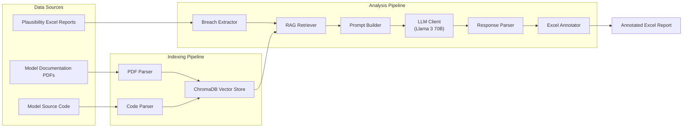

# Plausibility AI — Project Overview

> **Status:** Prototype → MVP (Phase 1)
> **Last Updated:** 2026-07-22
> **Audience:** Internal Engineering Team

---

## 1. Problem Statement

### The Plausibility Testing Challenge

Financial institutions are required to perform **plausibility testing** on their risk models — a process that validates whether model outputs (e.g., interest rate projections, property valuations, credit risk metrics) behave sensibly under various stress scenarios.

These tests produce **Excel-based reports** containing hundreds to thousands of rows, each representing a validation rule applied to a model. When a model output breaches a predefined threshold, it is flagged as a **breach** (or warning/flag), and a subject-matter expert (SME) must:

1. **Review** each breached row.
2. **Understand** the context — what the model does, what the rule checks, what the thresholds mean.
3. **Cross-reference** model documentation (PDFs) and source code to determine root cause.
4. **Write** a severity assessment, root-cause analysis, and recommendation.
5. **Cite** evidence from documentation and code.

### Pain Points

| Pain Point | Impact |
|---|---|
| **Volume** — Dozens of reports per month, each with potentially hundreds of breaches | Analyst time is consumed by repetitive review |
| **Context switching** — Analysts must constantly jump between Excel, PDFs, and code | High cognitive load, slow turnaround |
| **Inconsistency** — Different reviewers apply different severity standards | Lack of standardised output quality |
| **Knowledge silos** — Model documentation is scattered across PDFs with no search capability | Onboarding new reviewers is slow |
| **No audit trail** — Manual comments lack traceable evidence chains | Compliance and governance risk |

---

## 2. Solution: Plausibility AI

Plausibility AI is a **RAG-powered (Retrieval-Augmented Generation) analysis tool** that automates the initial triage and commentary of plausibility test breaches.

### How It Works

```
┌─────────────────────────────────────────────────────────────────────┐
│                        OFFLINE PIPELINE                            │
│                                                                    │
│   Model PDFs  ──►  PDF Parser  ──►  Chunking  ──►  ┐              │
│                                                     │  ChromaDB    │
│   Model Code  ──►  AST Parser  ──►  Chunking  ──►  ┘  (Vectors)  │
│                                                                    │
└─────────────────────────────────────────────────────────────────────┘

┌─────────────────────────────────────────────────────────────────────┐
│                        ANALYSIS PIPELINE                           │
│                                                                    │
│   Excel Report ──► Breach Extraction ──► For each breach:          │
│                                            │                       │
│                                            ▼                       │
│                                    RAG Retrieval                   │
│                                    (docs + code)                   │
│                                            │                       │
│                                            ▼                       │
│                                    Prompt Builder                  │
│                                    (context + breach)              │
│                                            │                       │
│                                            ▼                       │
│                                    LLM Analysis                    │
│                                    (self-hosted Llama 3 70B)       │
│                                            │                       │
│                                            ▼                       │
│                                    Response Parser                 │
│                                    (JSON → structured result)      │
│                                            │                       │
│                                            ▼                       │
│                                    Excel Annotator                 │
│                                    (annotated output file)         │
│                                                                    │
└─────────────────────────────────────────────────────────────────────┘
```

### What It Produces

For each breached row, the tool appends new columns to the original Excel report:

| Column | Description |
|---|---|
| **AI Severity** | `Critical` / `Major` / `Moderate` / `Minor` / `Informational` — colour-coded |
| **AI Comment** | Expert-style narrative explanation (2–4 sentences) |
| **AI Root Cause** | Most likely technical cause of the breach |
| **AI Confidence** | `high` / `medium` / `low` — reflects quality of retrieved context |
| **AI Evidence** | Cited excerpts from documentation and code, with references |
| **AI Expected Behavior** | Whether the breach is explainable (e.g., due to extreme scenario shocks) |
| **AI Requires Investigation** | Whether manual follow-up is recommended |
| **Reviewer Status** | Dropdown: `Approved` / `Rejected` / `Modified` / `Pending` |
| **Reviewer Comment** | Free text for the human reviewer |

An **AI Summary** sheet is also generated with severity breakdowns and a list of low-confidence items requiring priority review.

---

## 3. Key Design Decisions

### 3.1 Self-Hosted LLM

The system uses a **self-hosted Llama 3 70B model** (via vLLM or similar OpenAI-compatible server) rather than a cloud API. This is critical for:

- **Data governance** — Plausibility data, model documentation, and code never leave the institution's network.
- **Cost control** — No per-token charges; the infrastructure cost is fixed.
- **Latency** — Local inference avoids network round-trips to external APIs.

### 3.2 RAG over Fine-Tuning

Rather than fine-tuning a model (which would require retraining when documentation changes), the system uses **Retrieval-Augmented Generation**:

- Model documentation and code are indexed into **ChromaDB** (a local vector database).
- At query time, relevant chunks are retrieved and injected into the LLM prompt.
- This ensures the LLM always works with the **latest** documentation.

### 3.3 Local Embeddings

Embeddings are computed locally using **BAAI/bge-small-en-v1.5** (via `sentence-transformers`), keeping the entire pipeline air-gapped from external services.

### 3.4 Structured JSON Output

The LLM is prompted to return structured JSON, which is validated via **Pydantic** schemas. This ensures:

- Consistent, machine-parseable output.
- Graceful degradation — if parsing fails, the breach is flagged for manual review rather than silently dropped.

---

## 4. Current Prototype State

### What Works

- ✅ PDF parsing and chunking (via `pymupdf4llm`)
- ✅ Python code parsing at function/class granularity (via AST)
- ✅ Vector storage and retrieval (ChromaDB with cosine similarity)
- ✅ Breach extraction from Excel reports
- ✅ RAG retrieval pipeline (docs + code, with similarity threshold filtering)
- ✅ LLM-based analysis with concurrent batch processing
- ✅ Pydantic-validated response parsing with error fallback
- ✅ Excel annotation with colour-coded severity, evidence citations, and summary sheet
- ✅ CLI interface (`index` and `analyze` commands)
- ✅ LLM-based metadata generation for model PDFs

### What's Missing (→ MVP Scope)

- ❌ No tests (test directory is empty)
- ❌ No `setup.py` / `pyproject.toml` — not installable as a package
- ❌ No Docker / containerisation
- ❌ No web UI for reviewers
- ❌ No logging infrastructure (basic `logging.basicConfig` only)
- ❌ No error reporting or monitoring
- ❌ No CI/CD pipeline
- ❌ No configuration validation or environment-specific configs
- ❌ Backtesting module is empty
- ❌ No `.gitignore` or project scaffolding
- ❌ No API layer (REST / gRPC)

---

## 5. Technology Stack

| Component | Technology | Purpose |
|---|---|---|
| **Language** | Python 3.14+ | Core runtime |
| **Package Manager** | Poetry (`pyproject.toml`) | Dependency management & packaging |
| **LLM** | Meta Llama 3 70B (self-hosted) | Breach analysis |
| **LLM Serving** | vLLM (OpenAI-compatible API) | Model inference server |
| **Embeddings** | BAAI/bge-small-en-v1.5 | Local semantic embeddings |
| **Vector DB** | ChromaDB (persistent) | Document/code index |
| **PDF Parsing** | PyMuPDF + pymupdf4llm | Markdown extraction from PDFs |
| **Code Parsing** | Python AST module | Function/class-level code chunking |
| **Excel I/O** | openpyxl | Read/write Excel plausibility reports |
| **HTTP Client** | httpx (async) | LLM API communication |
| **Retry Logic** | tenacity | Exponential backoff for API calls |
| **Validation** | Pydantic v2 | LLM response schema validation |
| **Config** | PyYAML + dataclasses | YAML-based configuration |
| **CLI** | Click + Rich | Command-line interface |

---

## 6. Value Proposition

### Quantitative Impact (Projected)

| Metric | Before | After (Projected) |
|---|---|---|
| Avg. time per breach review | 10–15 min | 2–3 min (review + approve AI output) |
| Analyst throughput (breaches/day) | 30–40 | 150–200 |
| Consistency of severity ratings | Variable | Standardised via LLM + rubric |
| Evidence citation | Often missing | Always present (RAG-sourced) |
| Time to onboard new reviewer | Weeks | Days (AI handles initial triage) |

### Qualitative Benefits

- **Audit readiness** — Every AI assessment includes cited evidence, confidence scores, and a human reviewer sign-off column.
- **Scalability** — Handles medium-scale workloads (10–50 models, dozens of reports/month) with concurrent LLM analysis.
- **Transparency** — Confidence levels and uncertainty notes make it clear when the AI is unsure.
- **Human-in-the-loop** — AI output is a *draft* for reviewer approval; the tool does not make final decisions.

---

## 7. Architecture Diagram



---

## 8. Glossary

| Term | Definition |
|---|---|
| **Plausibility Test** | A validation check that assesses whether a model's output is reasonable under given conditions |
| **Breach** | When a model output exceeds a predefined threshold in a plausibility test |
| **Mnemonic** | A short code identifying a specific validation rule |
| **Scenario Shock** | A stress test parameter (e.g., +200bps interest rate shock) |
| **RAG** | Retrieval-Augmented Generation — augmenting LLM prompts with retrieved context |
| **SME** | Subject-Matter Expert — the human reviewer of plausibility results |

